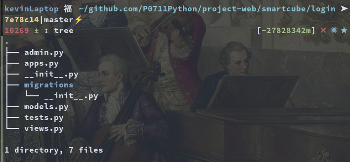

<div align='center' ><font size='60'>进行Web服务端的编程</font></div>

## 1.创建该项目的初衷
进行Python+Django+Vue+MySQL的实验编程

## 2.判断http的服务端是否有运行
python -m http.server
可以通过浏览器访问8000，进行查看，正常是显示如下内容
就是文件列表

## 3.安装工具
pyenv:  使用系统自带的工具进行安装

## 4.django如何使用
### pyenv安装相关的python版本

``` shell
cd web-server
pyenv install 3.8.15
pyenv local 3.8.15
python --version 确认版本
```

### 创建一个Django的服务工程
``` shell
pip install django
django startproject smartcube(项目名称)
cd smartcube
python manager runserver
python manager shell            #进入python交互界面
```

### 创建一个Django的应用
``` shell
python manage.py startapp login   #login是app的名称
```


### 在models中创建数据
a.修改apps中的models.py文件
b.使用makeimagration创建0001之类的数据文件
c.使用migrate创建数据库数据
以下命令用于展示0001脚本执行的内容
    python manage.py sqlmigrate xxx-app 0001
d.注意还需要在工程的settings.py目录中进行应用注册
e.如果要想在django的后台服务进行管理，还需要进行注册
在应用之下的admin.py中进行注册
admin.site.register(Person)

参考链接:
https://developer.mozilla.org/zh-CN/docs/Learn/Server-side/Django/development_environment

## 5.获取Django的工作目录
python -c "import django; print(django.__path__)"

## 6.安装vue开发环境
a.预先装好npm
b.npm init vue@latest   #安装最新的vue框架
参考
https://cn.vuejs.org/

## 7.什么是ORM
ORM全称是：Object Relational Mapping(对象关系映射)，其主要作用是在编程中，把面向对象的概念跟数据库中表的概念对应起来。举例来说就是，我定义一个对象，那就对应着一张表，这个对象的实例，就对应着表中的一条记录

## 附录
国内下载各个版本的python的路径
https://registry.npmmirror.com/binary.html?path=python/

## 学习网站

a.学习CSS网站
https://developer.mozilla.org/zh-CN/docs/Learn/CSS/First_steps/What_is_CSS
b.学习django
https://www.liujiangblog.com/course/django/95
https://docs.djangoproject.com/en/4.1/topics/db/models/
c.学习vue
https://cn.vuejs.org/examples/#hello-world
d.学习element
https://element.eleme.cn/#/zh-CN/component/quickstart
